# ER 图（核心关系）

```mermaid
erDiagram
    products ||--o{ product_skus : "吉客云 goods_id"
    product_skus ||--o{ inventory_snapshots : "库存快照"
    stores }o--|| sales_channels : "渠道"
    stores ||--o{ sales_orders : "店铺"
    sales_orders ||--o{ sales_order_items : "1:N"
    product_skus ||--o{ sales_order_items : "SKU"
    sales_orders ||--o{ aftersales_orders : "售后"
    sales_orders ||--o{ shipments : "发货"

    suppliers ||--o{ external_purchase_orders : "1688 店铺"
    external_purchase_orders ||--o{ external_purchase_order_raw_items : "原始明细"
    external_purchase_orders ||--o{ purchase_allocation_items : "多 SKU 分配"
    product_skus ||--o{ purchase_allocation_items : "N:1 吉客云 SKU"
    external_purchase_orders ||--o{ purchase_extra_expenses : "附加费用"
    external_purchase_orders }o--o{ purchase_invoices : "purchase_invoice_links 多对多"
    external_purchase_orders }o--o{ jackyun_purchase_orders : "关联吉客云采购单"
    external_purchase_orders ||--o{ inbound_links : "入库"

    bank_accounts ||--o{ bank_transactions : "流水"
    bank_import_batches ||--o{ bank_transactions : "导入批"
    bank_transactions ||--o{ reconciliation_matches : "匹配"
    settlement_records ||--o{ reconciliation_matches : "应收"
    counterparty_mapping_rules }o--|| bank_transactions : "对方户名→平台"

    product_skus ||--o{ cost_snapshots : "成本快照"
    profit_snapshots }o--|| monthly_finance_periods : "月结维度"

    archive_files ||--o{ finance_delivery_files : "归档文件"
    monthly_finance_periods ||--o{ finance_delivery_packages : "月度交付包"
    finance_delivery_packages ||--o{ finance_delivery_files : "包含"
    finance_delivery_packages ||--o{ email_delivery_logs : "发送记录 first/resent"
    monthly_finance_periods ||--o{ closing_versions : "V1/V2 月结版本"

    integration_connections ||--o{ sync_jobs : "同步任务"
    sync_jobs ||--o{ sync_logs : "调用日志"
    sync_jobs ||--o{ sync_checkpoints : "增量断点"
    raw_api_payloads }o--|| integration_connections : "raw 存档"
```

## 关键约束

- `external_purchase_orders.external_order_id` UNIQUE —— 1688 幂等（规格 16）
- `bank_transactions.fingerprint` UNIQUE —— 账户+日期+金额+流水号，空流水号用可重复 hash
- `archive_files` 唯一键含 version —— 同名不静默覆盖
- `email_delivery_logs.kind` first/resent —— 一个账期+版本仅一条首次成功发送
- `profit_snapshots` 保存 formula_version / data_version / calculated_at
- 金额列统一 `Numeric(18,4)`，数据库层面杜绝 float
